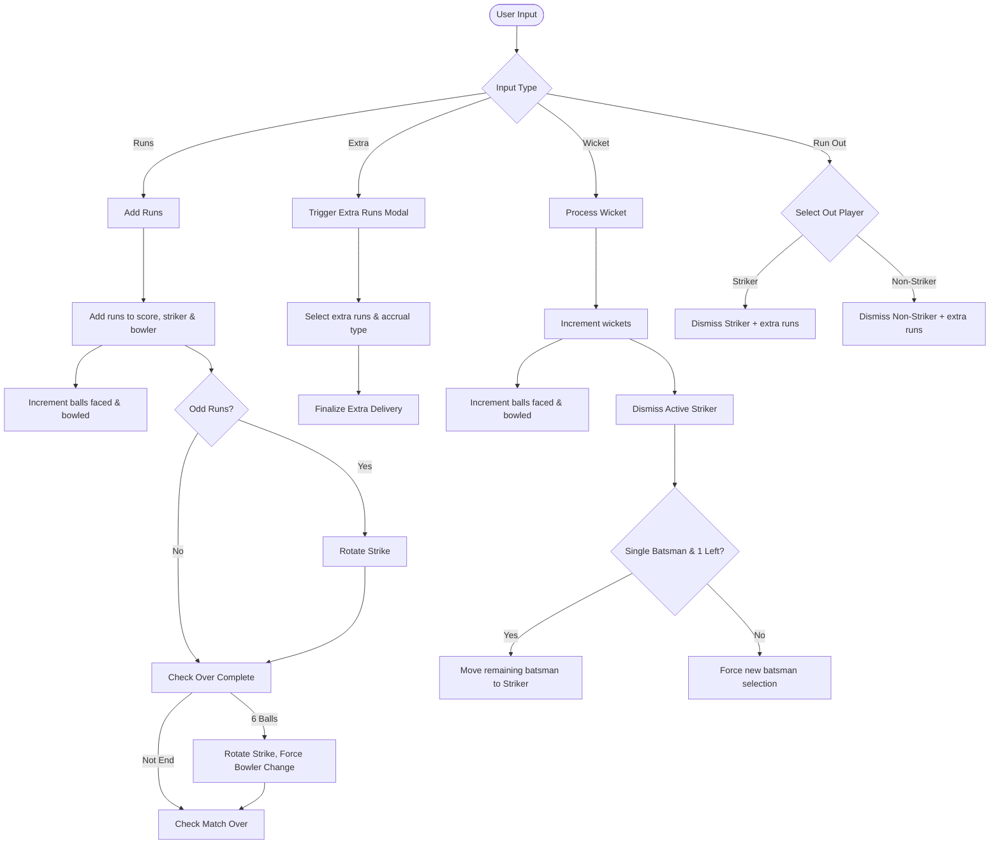

# Design Document: Cricket Scorecard PWA

## 1. Overview
The Cricket Scorecard PWA is a standalone, mobile-optimized Progressive Web App designed to track scores offline during a cricket match. It supports standard cricket scoring rules with custom extensions (like single batsman play) and features a clean, screenshot-friendly "Full Scorecard" view for sharing match results.

## 2. Architecture & Tech Stack
The application is built with a minimalist approach to ensure ease of deployment (GitHub Pages) and offline capability:
- **Frontend**: Vanilla HTML5, CSS3, and JavaScript (ES6+).
- **Styling**: Bootstrap 5 (via CDN) for responsive, mobile-first UI components.
- **PWA Capabilities**: Service Worker (`sw.js`) for caching assets and offline access; Web App Manifest (`manifest.json`) for installability.
- **State Persistence**: `localStorage` to save match state across reloads.
- **State Sharing**: URL-based sharing using `LZString` compression for compact permalinks.
- **Testing**: Node.js test script (`test.js`) using a mocked DOM environment to validate core scoring logic.

---

## 3. Data Structures

The application state is centralized in a single `gameState` object:

```javascript
let gameState = {
    settings: {
        totalInnings: 1,            // Hardcoded to 1
        oversPerInnings: 8,         // Total overs per innings
        maxOversPerBowler: 2,       // Limit per bowler
        widePenalty: 1,             // Fixed at 1
        noBallPenalty: 1,           // Fixed at 1
        allowSingleBatsman: true,   // Allows 1 batsman to play alone
        theme: 'light',             // UI Theme ('light', 'dark', 'green')
        enableLegByes: false        // Leg byes toggle
    },
    match: {
        currentInnings: 1,          // 1 or 2
        currentBattingTeam: 1,      // 1 or 2
        team1: { 
            name: "Team 1", 
            players: [],            // List of player names
            innings: []             // Historical innings data (when completed)
        },
        team2: { 
            name: "Team 2", 
            players: [], 
            innings: [] 
        },
        liveInnings: {
            score: 0,
            wickets: 0,
            balls: 0,               // Total legal/illegal balls bowled that count towards overs
            extras: { 
                wides: 0, 
                noballs: 0, 
                byes: 0, 
                legbyes: 0 
            },
            batsmen: {
                // "Player Name": { runs: 0, balls: 0, active: boolean }
            },
            bowlers: {
                // "Player Name": { runs: 0, balls: 0, wickets: 0, wides: 0, noballs: 0 }
            },
            currentBatsman1: "",    // Striker (traditionally)
            currentBatsman2: "",    // Non-striker
            currentBowler: "",
            previousBowler: null,   // Used to prevent consecutive overs
            outBatsmen: [],         // List of dismissed batsmen
            overLog: []             // Sequence of events in current over (e.g., ["0", "wd", "W"])
        },
        target: null,               // Target score for 2nd innings
        matchOver: false
    },
    history: []                     // Stack of past match states for Undo functionality
};
```

---

## 4. Control Flow & Core Logic

### 4.1. Match Initialization
1.  **Roster Entry**: Users can input players manually, via bulk import (comma/newline separated), or mirror "shared" players across both teams (indicated by `🔁`).
2.  **Validation**: Before starting, the app checks if:
    *   Teams have enough players to bowl all overs based on `maxOversPerBowler`.
    *   Teams have enough batsmen (at least 2, or 1 if `allowSingleBatsman` is enabled).
3.  **Toss**: A modal prompts for the toss winner and their choice (batting first). This initializes the batting/bowling team roles.

### 4.2. Scoring Loop & Strike Rotation
The scoring flow is driven by user input buttons:



#### Detailed Delivery Processing
-   **Wides**: 1 penalty run + extra runs. Does not count as a ball faced or bowled. Extra runs can accrue to byes or batsman (if hit).
-   **No Balls**: 1 penalty run + extra runs. Counts as ball faced for batsman, but not bowler. Extra runs accrue to batsman or byes.
-   **Byes**: Base 1 run + extra runs. Counts as ball faced and bowler ball, but runs do not accrue to batsman.
-   **Leg Byes**: 1 run. Counts as ball faced and bowler ball. Disabled if `enableLegByes` is false.
-   **Wickets**: Standard dismissal. Increments batsman balls faced.
-   **Run Outs**: Wicket + optional extra runs. Striker's balls faced is incremented regardless of who is run out.

### 4.3. Innings & Match Transitions
-   **End of Innings 1**: Triggered when all batsmen are out or max overs are bowled.
    *   Live innings state is saved to the team's history.
    *   Target is set (`score + 1`).
    *   Roles swap, and `currentInnings` becomes 2.
-   **Match Over**: Checked after every delivery in Innings 2:
    *   Chasing team score >= Target $\rightarrow$ Batting team wins.
    *   Chasing team wickets >= Max Wickets $\rightarrow$ Bowling team wins.
    *   Chasing team balls >= Max Balls $\rightarrow$ Bowling team wins (or Tie if scores are equal).
    *   *Upon match end, the final live innings is archived into the team's history before disabling controls.*

### 4.4. State Persistence & URL Sharing
-   **Local Storage**: Every action (runs, wickets, undo, reset) calls `saveToLocalStorage()` which serializes `gameState` to JSON.
-   **Permalink Generation**:
    *   To keep URLs short, `minifyState()` converts `gameState` keys to short aliases (e.g., `score` $\rightarrow$ `sc`, `liveInnings` $\rightarrow$ `li`).
    *   The minified JSON is compressed using `LZString.compressToEncodedURIComponent`.
    *   The resulting string is appended to the URL as `?s=...` (e.g., `https://.../?s=EqCw...`).
    *   Legacy uncompressed `?state=...` links are still supported for backwards compatibility.

---

## 5. UI/UX Decisions

-   **3D Page Flip**: A CSS transform-based flip transition is used to toggle between the scoring interface (front) and the screenshot view (back). This provides a physical "flipping" card feel.
-   **Active Striker Indicator**: Instead of using an asterisk (`*`) which can look cluttered, the active batsman's dropdown container is highlighted with a distinct background color and border.
-   **Controls Disabling**: All scoring controls are disabled if a batsman or bowler selection is pending, preventing invalid entries.
-   **Screenshot View**: Rendered using standard HTML tables with a monospace font (`Courier New`/`monospace`) to ensure perfect alignment when users take screenshots on different mobile devices.

---

## 6. Testing Strategy

The `test.js` file runs in Node.js and tests the core scoring logic without a real browser environment.
-   **DOM Mocking**: Since `app.js` interacts heavily with the DOM, `test.js` mocks `document.getElementById`, `document.querySelector`, and various element properties (like `value`, `textContent`, `classList`) in the global scope.
-   **Code Injection**: `test.js` reads `app.js`, replaces `let gameState =` with `global.gameState =` to make the state inspectable, and runs `eval()` on the modified code.
-   **Unit Tests**: Includes 15 distinct test cases verifying:
    *   Runs accumulation and strike rotation.
    *   Extras calculations (Wides, No Balls, Byes) and run-out logic.
    *   Innings completion and target calculation.
    *   Auto-selection and lone-striker enforcement.

---

## 7. Known Issues & Limitations

1.  **Single Innings Only**: The system is strictly limited to 1 innings per team.
2.  **Hardcoded Penalties**: Wides and No Balls are hardcoded to a 1-run penalty.
3.  **Manual DOM Updates**: Because the app uses Vanilla JS, state synchronization with the DOM is done manually in `updateUI()`. This can lead to bugs if a state change is not accompanied by a UI refresh.
4.  **No True Database**: Relying solely on `localStorage` means clearing browser data deletes match history. Permalinks are the only way to backup matches.
