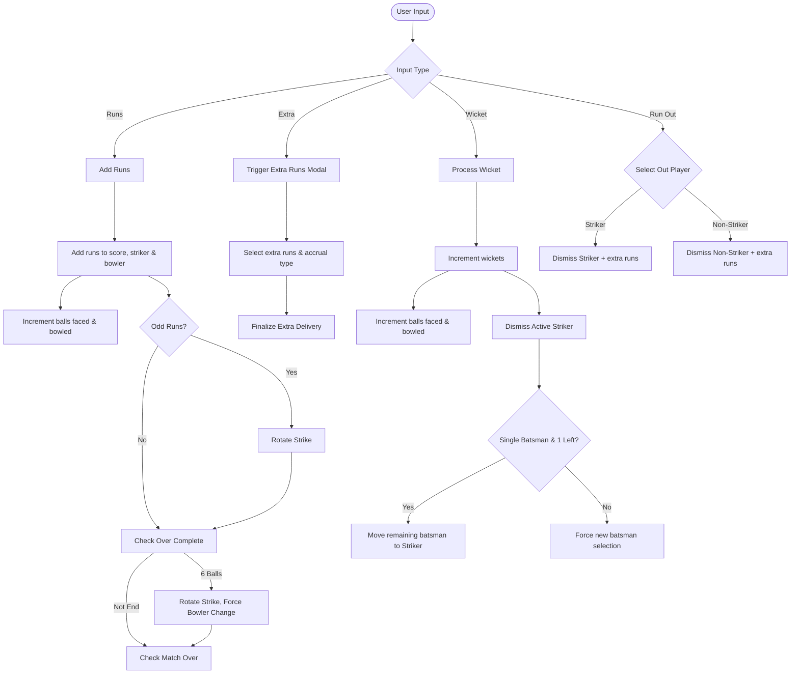
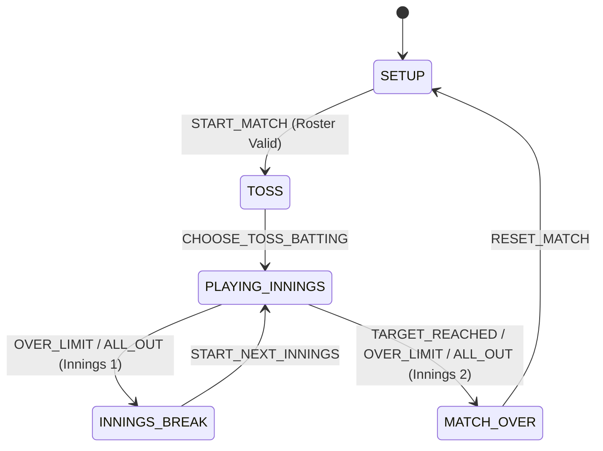

# Design Document: Cricket Scorecard PWA

## 1. Overview
The Cricket Scorecard PWA is a standalone, mobile-optimized Progressive Web App designed to track scores offline during a cricket match. It supports standard cricket scoring rules with custom extensions (like single batsman play) and features a clean, screenshot-friendly "Full Scorecard" view for sharing match results.

## 2. Architecture, TypeScript Target & Tech Stack

The application is structured as a TypeScript Progressive Web App, utilizing Vite for bundling and asset pipelines:
- **Frontend**: TypeScript (transpiled to standard modern ES2022 JavaScript).
- **Build Toolchain (Vite)**: Dev server with fast HMR; production builds compile files, minify scripts, and generate outputs inside `dist/`.
- **Source Directory Structure**:
  - `src/types.ts`: Central TypeScript interface models and action type definitions.
  - `src/app.ts`: Main PWA entry point, handles service worker lifecycle and root event routing.
  - `src/state.ts`: Central game state store coordinator and undo history wrapper.
  - `src/storage.ts`: LZString state compression/decompression and storage minification logic.
  - `src/reducer.ts`: Pure reducer state machine managing match state calculations, strike rotations, and validation.
  - `src/sync.ts`: Real-time multi-reader live state sync engine, storage provider abstraction, write-token authorization, and 1-year TTL management.
  - `src/modal.ts`: Universal zero-dependency modal controller and W3C WAI-ARIA focus management.
  - `src/version.ts`: Centralized semantic version constants (`APP_VERSION`), dynamic tagging calculations (`v$yyyy.$mm.$nnn`), and release records.
  - `src/release_notes.ts`: Release notes modal rendering, highlights, commit manifest streams, and version badge event bindings.
  - `src/feedback.ts`: Bug reporting engine and diagnostic Markdown generator.
  - `src/ui.ts`: Cached DOM selectors, event listeners, and UI rendering bindings.
  - `scripts/release.js`: Automated release management CLI with semantic tagging, commit compilation, and git tag push.
- **Styling**: Bootstrap 5 (via CDN) for responsive, mobile-first UI components.
- **PWA Capabilities**: Service Worker (`sw.js`) compiled into `dist/` root, caching static assets for offline capability; Web App Manifest (`manifest.json`) for installation.
- **State Persistence**: `localStorage` to save match state across reloads.
- **State Sharing**: URL-based sharing using `LZString` compression for compact permalinks, plus real-time cloud live streaming with 1-year retention.
- **Testing**: Node.js test runner using `ts-node` to run TypeScript assertions (`test/test_cases.ts`) in a mock DOM environment.

---

## 3. Data Structures

The application state is centralized in a single `gameState` object:

```javascript
let gameState = {
    settings: {
        totalInnings: 1,            // Hardcoded to 1
        oversPerInnings: 8,         // Total overs per innings
        maxOversPerBowler: 2,       // Limit per bowler
        widePenalty: 1,             // Fixed at 1
        noBallPenalty: 1,           // Fixed at 1
        allowSingleBatsman: true,   // Allows 1 batsman to play alone
        theme: 'light',             // UI Theme ('light', 'dark', 'green')
        enableLegByes: false        // Leg byes toggle
    },
    match: {
        currentInnings: 1,          // 1 or 2
        currentBattingTeam: 1,      // 1 or 2
        team1: { 
            name: "Team 1", 
            players: [],            // List of player names
            innings: []             // Historical innings data (when completed)
        },
        team2: { 
            name: "Team 2", 
            players: [], 
            innings: [] 
        },
        liveInnings: {
            score: 0,
            wickets: 0,
            balls: 0,               // Total legal/illegal balls bowled that count towards overs
            extras: { 
                wides: 0, 
                noballs: 0, 
                byes: 0, 
                legbyes: 0 
            },
            batsmen: {
                // "Player Name": { runs: 0, balls: 0, fours: 0, sixes: 0, active: boolean }
            },
            bowlers: {
                // "Player Name": { runs: 0, balls: 0, wickets: 0, maidens: 0, wides: 0, noballs: 0 }
            },
            currentBatsman1: "",    // Striker (traditionally)
            currentBatsman2: "",    // Non-striker
            currentBowler: "",
            previousBowler: null,   // Used to prevent consecutive overs
            outBatsmen: [],         // List of dismissed batsmen
            fow: [],                // Fall of Wickets: [{ wicket: 1, score: 10, batsman: "P1", overs: "0.4" }]
            overs: [],              // Array of completed overs: { bowler: string, balls: string[] }
            overLog: []             // Sequence of events in current over (e.g., ["0", "wd", "W"])
        },
        target: null,               // Target score for 2nd innings
        matchOver: false
    },
    history: []                     // Stack of past match states for Undo functionality
};
```

---

## 4. Control Flow & Core Logic

### 4.1. Match Initialization
1.  **Roster Entry**: Users can input players manually, via bulk import (comma/newline separated), or mirror "shared" players across both teams (indicated by `🔁`).
2.  **Validation**: Before starting, the app checks if:
    *   Teams have enough players to bowl all overs based on `maxOversPerBowler`.
    *   Teams have enough batsmen (at least 2, or 1 if `allowSingleBatsman` is enabled).
3.  **Toss**: A modal prompts for the toss winner and their choice (batting first). This initializes the batting/bowling team roles.

### 4.2. Scoring Loop & Strike Rotation
The scoring flow is driven by user input buttons:



#### Detailed Delivery Processing
-   **Wides**: 1 penalty run + extra runs. Does not count as a ball faced or bowled. Extra runs can accrue to byes or batsman (if hit).
-   **No Balls**: 1 penalty run + extra runs. Counts as ball faced for batsman, but not bowler. Extra runs accrue to batsman (charged to bowler) or byes (fielding extra, not charged to bowler).
-   **Byes**: Base 1 run + extra runs. Counts as ball faced and bowler ball, but runs do not accrue to batsman. Strike rotates on odd physical runs (1 + extraRuns) prior to evaluating over completion.
-   **Leg Byes**: Base 1 run + extra runs (supports multi-run leg byes). Counts as ball faced for active striker and bowler ball. Strike rotates on odd leg byes. Disabled if `enableLegByes` is false.
-   **Wickets**: Standard dismissal. Increments batsman balls faced, marks out batsman inactive, records Fall of Wickets entry, and appends to `outBatsmen` prior to checking all-out transitions.
-   **Run Outs**: Wicket + optional extra runs. Striker's balls faced is incremented regardless of who is run out. If odd runs were completed before the run out, strike switches for the surviving batsman to reflect crossed ends.
-   **Batsman Slot Assignment**: Handled via [`assignBatsmanToSlot`](file:///usr/local/google/home/vakh/git/hub/aawc/cricket-scorecard-pwa/src/reducer.ts#L441) and [`getStriker`](file:///usr/local/google/home/vakh/git/hub/aawc/cricket-scorecard-pwa/src/reducer.ts#L400). Contextually assigns `active = !otherSlotBatsman.active` to maintain the invariant that exactly one batsman is active whenever two batsmen are on the field.
-   **Over Completion**: When 6 legal balls are bowled, maiden calculation evaluates whether bowler conceded 0 runs, the over is pushed to the `overs` array, `overLog` is cleared, and strike is rotated for the new over. If the innings ends mid-over (all out or target reached), the incomplete over is saved to `overs` upon transition.

### 4.3. Innings & Match Transitions
-   **End of Innings 1**: Triggered when all batsmen are out or max overs are bowled.
    *   Live innings state is saved to the team's history.
    *   Target is set (`score + 1`).
    *   Roles swap, and `currentInnings` becomes 2.
-   **Match Over**: Checked after every delivery in Innings 2:
    *   Chasing team score >= Target $\rightarrow$ Batting team wins.
    *   Chasing team wickets >= Max Wickets $\rightarrow$ Bowling team wins.
    *   Chasing team balls >= Max Balls $\rightarrow$ Bowling team wins (or Tie if scores are equal).
    *   *Upon match end, the final live innings is archived into the team's history before disabling controls.*

### 4.4. State Persistence & URL Sharing
-   **Local Storage**: Every action (runs, wickets, undo, reset) calls `saveToLocalStorage()` which serializes `gameState` to JSON directly, preserving all fields (including phase and history).
-   **Permalink Generation**:
    *   To keep URLs short, `minifyState()` converts `gameState` keys to short aliases (e.g., `score` $\rightarrow$ `sc`, `liveInnings` $\rightarrow$ `li`, `overs` $\rightarrow$ `ov`, `bowler` $\rightarrow$ `bo`, `balls` $\rightarrow$ `bl`).
    *   The active game phase is serialized under the key `ph` (e.g., `ph: state.phase`).
    *   The minified JSON is compressed using `LZString.compressToEncodedURIComponent`.
    *   The resulting string is appended to the URL as `?s=...` (e.g., `https://.../?s=EqCw...`).
    *   Legacy uncompressed `?state=...` links are still supported for backwards compatibility.
-   **Permalink Decoding & Reconstruction**:
    *   Upon loading a permalink, `unminifyState()` decompresses the JSON and remaps keys back to their original names.
    *   To ensure the state machine stores remain fully operational:
        *   The active `phase` is restored from `ph`. For legacy links that lack the `ph` key, the phase is dynamically inferred from match parameters (e.g., `matchOver === true` $\rightarrow$ `MATCH_OVER`; target set but Innings 2 not started $\rightarrow$ `INNINGS_BREAK`; else default to `PLAYING_INNINGS`).
        *   The `history` stack is initialized to an empty array `[]` (undo history is not preserved across shares) to prevent dispatch action failures.

### 4.5. Game Flow State Machine
To prevent edge-case violations and decouple the scoring engine from direct UI callbacks, the application game loop is managed by a centralized state machine (Reducer pattern). 



#### 1. Match Phases (States)
The game transitions between the following phases:
*   **`SETUP`**: Roster editing and settings selection. Allowed: `ADD_PLAYER`, `DELETE_PLAYER`, `UPDATE_SETTINGS`, `START_MATCH`.
*   **`TOSS`**: Toss winner selection. Allowed: `CHOOSE_TOSS_BATTING`.
*   **`PLAYING_INNINGS`**: Match active, scoring controls enabled. Allowed: `ADD_RUNS`, `ADD_WICKET`, `ADD_LEG_BYE`, `FINALIZE_DELIVERY`, `CHANGE_BATSMAN`, `CHANGE_BOWLER`, `UNDO`.
*   **`INNINGS_BREAK`**: First innings completed, target set. Displays `#innings-break-banner` with `▶ Start 2nd Innings` (`#start-next-innings-btn`). Scoring controls locked. Allowed: `START_NEXT_INNINGS`, `UNDO`, `RESET_MATCH`.
*   **`MATCH_OVER`**: Match completed, match state immutable, scoring and player selectors locked. Allowed: `RESET_MATCH`.

#### 2. Reducer Dispatch Flow
Every user interaction dispatches a synchronous Action object: `{ type: 'ACTION_TYPE', payload: { ... } }`.
The Reducer computes the next state deterministically:
$$\text{Reducer}(\text{State}, \text{Action}) \rightarrow \text{New State}$$

#### 3. State-Driven UI Events (Side Effects)
Asynchronous side-effects (like Bootstrap alerts and modals) are managed by appending an event descriptor to `gameState.uiEvents` inside the state. The UI orchestrator processes this queue on every state update, resolving the callbacks by dispatching subsequent transition actions (e.g. `START_NEXT_INNINGS` upon modal dismissal).

---


## 5. UI/UX Decisions

-   **3D Page Flip**: A CSS transform-based flip transition is used to toggle between the scoring interface (front) and the screenshot view (back). This provides a physical "flipping" card feel.
-   **Active Striker Indicator**: Instead of using an asterisk (`*`) which can look cluttered, the active batsman's dropdown container is highlighted with a distinct background color and border.
-   **Controls Disabling**: All scoring controls are disabled if a batsman or bowler selection is pending, preventing invalid entries.
-   **Screenshot View**: Rendered using standard HTML tables with a monospace font (`Courier New`/`monospace`) to ensure perfect alignment when users take screenshots on different mobile devices.
-   **Over History (U1 & U2)**: 
    *   **U1 (Main Screen)**: A collapsible list displays completed overs. Clicking an over expands it to show ball-by-ball details using event delegation to handle clicks efficiently.
    *   **U2 (Scorecard)**: A monospace "Over Log" table renders all overs, including the active incomplete over (marked with `*` if in-progress), calculating totals dynamically using a parser helper.

---

## 6. Testing Strategy

The test suite runs in Node.js using `ts-node` to execute TypeScript assertions directly without requiring a compilation step.
-   **Runner (`test/test.ts`)**: Mocks browser DOM APIs in the global Node scope, uses ESM ts-node loader to dynamically import the TypeScript source modules from `src/`, binds modules to global variables for test compatibility, and executes the suite.
-   **Test Cases (`test/test_cases.ts`)**: Written in TypeScript with type definitions, verifying:
    *   Runs accumulation, boundary tracking (`4s`, `6s`), and strike rotation.
    *   Bowler maiden over calculation (`M`) and Economy rates (`Econ`).
    *   Fall of Wickets (`FOW`) progression recording on dismissals and run-outs.
    *   Extras calculations (Wides, No Balls, Byes, Multi-run Leg Byes) and run-out logic.
    *   Innings completion, early declaration (`FORCE_END_INNINGS`), and target calculation.
    *   Auto-selection and lone-striker enforcement.
    *   Completed over archiving and incomplete final over storage.
    *   Minification/unminification of historical over and stat data.
    *   Plaintext scorecard text generation and one-click copy.

---

## 7. Known Issues & Limitations

1.  **Single Innings Only**: The system is currently optimized for limited-overs matches (1 innings per team).
2.  **Hardcoded Penalties**: Wides and No Balls default to a standard 1-run penalty.
3.  **Manual DOM Updates**: Because the app uses Vanilla JS/TypeScript, state synchronization with the DOM is done via `updateUI()`.
4.  **No True Database**: Relying solely on `localStorage` means clearing browser data deletes match history. Permalinks and plaintext exports provide easy backup.

---

## 8. Completed Improvements

To track history and progress, the following major refactorings have been successfully completed:

1.  **Modular Architecture (Code Organization)**:
    *   Deconstructed monolithic `app.js` into distinct ES6 modules (`src/app.ts`, `src/state.ts`, `src/storage.ts`, `src/reducer.ts`, `src/ui.ts`) to separate concerns and improve maintainability.
    *   Cleaned up test suite by separating the runner mock framework (`test/test.ts`) from test cases (`test/test_cases.ts`).

2.  **Formal State Machine (Game Flow Control)**:
    *   Replaced disjointed boolean checks (`matchStarted`, `matchOver`, etc.) with a mathematically strict game flow state machine inside `src/reducer.ts`.
    *   Decoupled async side-effects (alerts/modals) using a state-driven `uiEvents` queue, making the scoring engine 100% pure and unit-testable synchronously.

3.  **TypeScript Migration (Type Safety & Tooling)**:
    *   Re-wrote the entire application code in TypeScript with strict interface declarations (`src/types.ts`).
    *   Integrated Vite bundler for hot-reloading development and minified production builds under `dist/`.
    *   Configured Node.js unit tests to execute directly on TypeScript modules via `ts-node/esm` loaders.
    *   Implemented a post-build asset crawler to dynamically inject hashed production bundles into the PWA Service Worker offline cache.

4.  **Batsman Strike Synchronization & Scorecard Accuracy Fixes**:
    *   Replaced hardcoded slot-based active striker assignment with contextual slot assignment ([`assignBatsmanToSlot`](file:///usr/local/google/home/vakh/git/hub/aawc/cricket-scorecard-pwa/src/reducer.ts#L441)) and robust striker resolution ([`getStriker`](file:///usr/local/google/home/vakh/git/hub/aawc/cricket-scorecard-pwa/src/reducer.ts#L400)), eliminating dual-active and dual-inactive states.
    *   Fixed leg bye delivery handling to increment active striker balls faced and rotate strike on odd runs.
    *   Fixed 6th-ball bye delivery pipeline to rotate physical runs before checking over completion.
    *   Fixed run out delivery pipeline to rotate strike for surviving batsman when odd extra runs are completed before dismissal.
    *   Fixed dismissal ordering in `ADD_WICKET` and `executeRunOutWicket` to record the out batsman in `outBatsmen` prior to all-out innings termination.
    *   Fixed winning margin calculations in [`updateUI`](file:///usr/local/google/home/vakh/git/hub/aawc/cricket-scorecard-pwa/src/ui.ts#L621) for Single Batsman play.
    *   Added automated unit tests 35-41 in [`test/test_cases.ts`](file:///usr/local/google/home/vakh/git/hub/aawc/cricket-scorecard-pwa/test/test_cases.ts#L1000-L1205).

5.  **Cricket Scoring Domain Enhancements & Accessibility**:
    *   Added boundary tracking (`4s` and `6s`) and batting Strike Rate (`SR`) calculation.
    *   Added bowler maiden over tracking (`M`) and Economy rate (`Econ`) calculation.
    *   Added chronological Fall of Wickets (`FOW`) progression recording and summary rendering.
    *   Added multi-run leg byes support (1, 2, 3, 4, 6 leg byes).
    *   Separated bowler conceded runs from fielding byes on No-Balls (Law 21.18).
    *   Added early declaration / forfeit / force end innings support (`FORCE_END_INNINGS`).
    *   Enforced red-green color blindness accessibility with double encoding (solid border + background tint + `[STRIKER]` badge text).
    *   Added Plaintext Scorecard generator ([`generateTextSummary`](file:///usr/local/google/home/vakh/git/hub/aawc/cricket-scorecard-pwa/src/ui.ts#L1018)) with one-click clipboard copying.
    *   Added automated unit tests 42-50 in [`test/test_cases.ts`](file:///usr/local/google/home/vakh/git/hub/aawc/cricket-scorecard-pwa/test/test_cases.ts#L1206-L1499).

6.  **User Feedback & Diagnostic Bug Reporting Mechanism**:
    *   Implemented an in-memory runtime error ring buffer ([`recordRuntimeError`](file:///usr/local/google/home/vakh/git/hub/aawc/cricket-scorecard-pwa/src/feedback.ts#L20-L64)) listening to `window.error` and `window.unhandledrejection`.
    *   Added structured Markdown diagnostic report generator ([`generateBugReportMarkdown`](file:///usr/local/google/home/vakh/git/hub/aawc/cricket-scorecard-pwa/src/feedback.ts#L106-L239)) that compiles user descriptions, match state figures (active striker/non-striker, bowler maidens/econ, FOW, extras), minified state JSON, and LZString permalink.
    *   Added interactive modal dialog (`#feedbackModal`) with real-time diagnostic preview accordion, one-click clipboard copy ([`copyBugReportToClipboard`](file:///usr/local/google/home/vakh/git/hub/aawc/cricket-scorecard-pwa/src/feedback.ts#L244-L275)), and pre-filled GitHub issue URL builder ([`getGitHubIssueUrl`](file:///usr/local/google/home/vakh/git/hub/aawc/cricket-scorecard-pwa/src/feedback.ts#L280-L293)).
    *   Added header "Feedback / Bug" button and footer shortcut in [`index.html:L24`](file:///usr/local/google/home/vakh/git/hub/aawc/cricket-scorecard-pwa/index.html#L24) and [`src/ui.ts:L1088-L1145`](file:///usr/local/google/home/vakh/git/hub/aawc/cricket-scorecard-pwa/src/ui.ts#L1088-L1145).
    *   Added automated unit tests 51-53 in [`test/test_cases.ts:L1500-L1625`](file:///usr/local/google/home/vakh/git/hub/aawc/cricket-scorecard-pwa/test/test_cases.ts#L1500-L1625).

7.  **Real-Time Multi-Reader Live State Sync & 1-Year Retention**:
    *   **Remote Storage Hosting Endpoint**: Live match states are stored in a serverless REST Key-Value store via [`CloudflareKVStorageProvider`](file:///usr/local/google/home/vakh/git/hub/aawc/cricket-scorecard-pwa/src/sync.ts#L98) connecting to Cloudflare Workers KV endpoints (`https://cricket-scorecard-live.khaneja.org/api/match/{matchId}`), with turnkey Google Apps Script support via [`GoogleSheetsStorageProvider`](file:///usr/local/google/home/vakh/git/hub/aawc/cricket-scorecard-pwa/src/sync.ts#L175).
    *   **Single-Writer / Multi-Reader Model**: Implemented a zero-cost cloud synchronization service ([`LiveSyncService`](file:///usr/local/google/home/vakh/git/hub/aawc/cricket-scorecard-pwa/src/sync.ts#L257)) in [`src/sync.ts`](file:///usr/local/google/home/vakh/git/hub/aawc/cricket-scorecard-pwa/src/sync.ts#L1) supporting 1 umpire author and N parallel spectators.
    *   **Cryptographic Role Isolation**: Umpire holds a private `writeKey` (`?live=<matchId>&key=<writeKey>`) stored in `localStorage`, while spectators receive a read-only link (`?live=<matchId>`). Write operations are validated via [`hashWriteKey()`](file:///usr/local/google/home/vakh/git/hub/aawc/cricket-scorecard-pwa/src/sync.ts#L37).
    *   **1-Year Retention TTL**: Transports state packets with a 365-day (31,536,000 seconds / [`ONE_YEAR_SECONDS`](file:///usr/local/google/home/vakh/git/hub/aawc/cricket-scorecard-pwa/src/sync.ts#L4)) expiration TTL enforced both server-side via HTTP query parameters and client-side via metadata timestamps (`expiresAt`).
    *   **Adaptive Polling & Visibility Optimization**: Spectators poll adaptively (3.5s active via [`ACTIVE_POLL_INTERVAL_MS`](file:///usr/local/google/home/vakh/git/hub/aawc/cricket-scorecard-pwa/src/sync.ts#L10), 15s when tab is backgrounded via [`BACKGROUND_POLL_INTERVAL_MS`](file:///usr/local/google/home/vakh/git/hub/aawc/cricket-scorecard-pwa/src/sync.ts#L11)).
    *   **Offline Tolerance & In-Memory Fallback**: Offline actions buffer in an in-memory and `localStorage` dirty queue, automatically syncing upon network restoration with monotonic sequence verification (`seq`). Automated tests utilize [`MemoryStorageProvider`](file:///usr/local/google/home/vakh/git/hub/aawc/cricket-scorecard-pwa/src/sync.ts#L57).
    *   **Spectator UX & Accessibility**: Read-only Spectator Mode locks scoring controls, renders a top live banner with connection status badges (`[LIVE - SYNCED]`, `[OFFLINE - RETRYING]`, `[SPECTATOR MODE]`), and permits theme toggling and full scorecard inspection.

8.  **Universal Zero-Dependency Modal Controller & WAI-ARIA Focus Management**:
    *   Implemented [`src/modal.ts`](file:///usr/local/google/home/vakh/git/hub/aawc/cricket-scorecard-pwa/src/modal.ts#L1) providing [`openModal()`](file:///usr/local/google/home/vakh/git/hub/aawc/cricket-scorecard-pwa/src/modal.ts#L30) and [`closeModal()`](file:///usr/local/google/home/vakh/git/hub/aawc/cricket-scorecard-pwa/src/modal.ts#L89) with native backdrop lifecycle management, keyboard/click dismissal, and automatic fallback when Bootstrap CDN fails.
    *   Guarantees W3C WAI-ARIA accessibility by actively blurring focused descendants before applying `aria-hidden="true"` and restoring focus to triggering elements upon dismissal.

9.  **Standardized Release Management & Semantic Tagging Architecture**:
    *   **Dynamic Timestamped Semantic Tagging (`v$yyyy.$mm.$nnn`)**: Authored [`src/version.ts`](file:///usr/local/google/home/vakh/git/hub/aawc/cricket-scorecard-pwa/src/version.ts#L1) defining [`APP_VERSION`](file:///usr/local/google/home/vakh/git/hub/aawc/cricket-scorecard-pwa/src/version.ts#L24), [`parseSemanticVersion()`](file:///usr/local/google/home/vakh/git/hub/aawc/cricket-scorecard-pwa/src/version.ts#L48), and [`getNextSemanticVersion()`](file:///usr/local/google/home/vakh/git/hub/aawc/cricket-scorecard-pwa/src/version.ts#L71) with automated rollover on year and month boundaries.
    *   **Release CLI Pipeline**: Authored [`scripts/release.js`](file:///usr/local/google/home/vakh/git/hub/aawc/cricket-scorecard-pwa/scripts/release.js#L1) orchestrating pre-release unit test gates, commit history compilation from git logs, release highlights generation, cross-file version synchronization, and automated annotated git tag creation and remote pushing.
    *   **Persistent Footer Release Badge**: Created an interactive `#footer-release-badge` in [`index.html`](file:///usr/local/google/home/vakh/git/hub/aawc/cricket-scorecard-pwa/index.html#L580) and [`src/style.css`](file:///usr/local/google/home/vakh/git/hub/aawc/cricket-scorecard-pwa/src/style.css#L1496) featuring a live update indicator and version pill.
    *   **Release Notes Modal View**: Implemented [`src/release_notes.ts`](file:///usr/local/google/home/vakh/git/hub/aawc/cricket-scorecard-pwa/src/release_notes.ts#L1) rendering `#releaseNotesModal` with categorized colorblind-safe badges (`[FEAT]`, `[FIX]`, `[DOCS]`, `[TEST]`, `[PERF]`), commit SHA links to GitHub, author attributions, and keyboard accessibility.
    *   **Developer Contributor Guidelines**: Authored [`CONTRIBUTING.md`](file:///usr/local/google/home/vakh/git/hub/aawc/cricket-scorecard-pwa/CONTRIBUTING.md#L1) and [`GEMINI.md`](file:///usr/local/google/home/vakh/git/hub/aawc/cricket-scorecard-pwa/GEMINI.md#L1) standardizing bug reproduction from diagnostic payloads, Red-Green regression testing, pure reducer rules, and release execution.

---

## 10. Future Architectural Roadmap

To transition this project from a prototype implementation to a professional, industry-standard codebase, we have planned the following structural improvements:

1.  **Reactive Rendering (UI Architecture)**:
    *   Currently, the UI is updated manually by traversing the DOM tree in `updateUI()`.
    *   **Goal**: Implement a lightweight reactive framework (such as Preact, Lit, or Signals) that automatically compiles the view in response to state transitions, eliminating manual DOM lookups.

2.  **Remote Storage Sync (Cloud Persistence)** - *Status: [IMPLEMENTED] (Production Ready)*:
    *   Zero-cost live streaming and remote 1-year state persistence implemented via [`src/sync.ts`](file:///usr/local/google/home/vakh/git/hub/aawc/cricket-scorecard-pwa/src/sync.ts#L1), [`docs/architecture/LIVE_SYNC_DESIGN.md`](file:///usr/local/google/home/vakh/git/hub/aawc/cricket-scorecard-pwa/docs/architecture/LIVE_SYNC_DESIGN.md#L1), and [`docs/deployment/DEPLOYMENT_AND_BACKEND_SETUP.md`](file:///usr/local/google/home/vakh/git/hub/aawc/cricket-scorecard-pwa/docs/deployment/DEPLOYMENT_AND_BACKEND_SETUP.md#L1).

---

## 10. TypeScript Types & Build Toolchain

### 1. Build Pipeline (Vite)
Vite is used to orchestrate development and production bundling. During local development (`npm run dev`), Vite hosts a hot-reloading development server that compiles TypeScript on-the-fly. For deployment (`npm run build`), Vite runs `tsc` for type-checking and compiles/bundles the code into the `dist/` folder.

### 2. Main Data Interfaces (`src/types.ts`)
The application state and action tree are governed by strict contracts:
- `BatsmanStats`: Tracks runs, balls faced, boundaries (`fours`, `sixes`), and active striker flag.
- `BowlerStats`: Tracks runs, balls bowled, wickets, maidens (`maidens`), wides, and noballs.
- `FallOfWicket`: Records chronological dismissal entries (`wicket`, `score`, `batsman`, `overs`).
- `LiveInnings`: Holds score, wickets, balls, extras, batsmen/bowler records, Fall of Wickets, over log, and completed overs.
- `GameState`: Houses settings, current innings, team profiles, and historical states.
- `Action`: Discriminated union of dispatchable store actions (e.g. `ADD_RUNS`, `ADD_WICKET`, `FINALIZE_DELIVERY`, `FORCE_END_INNINGS`, `UNDO`).
